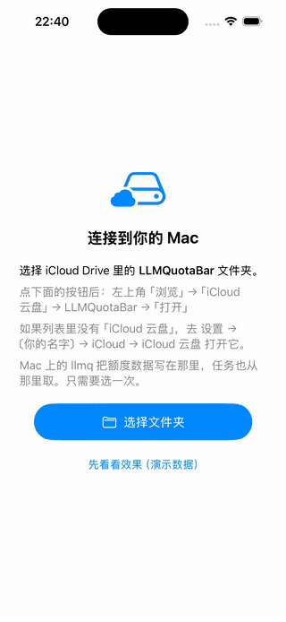
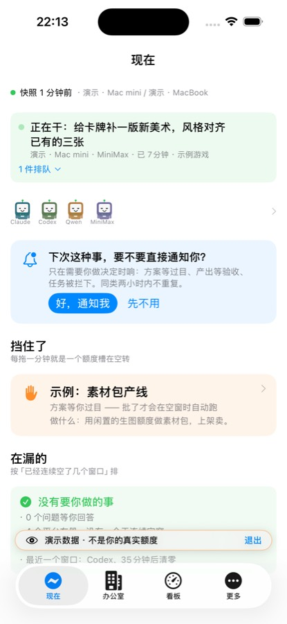
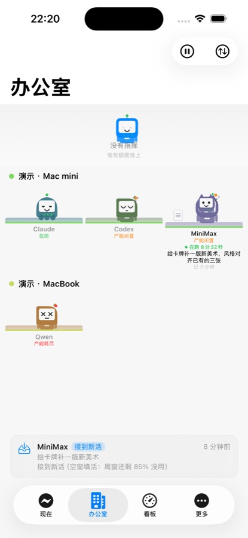
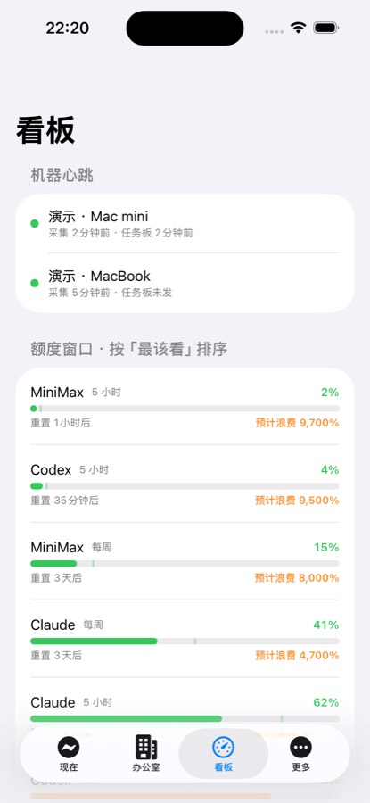
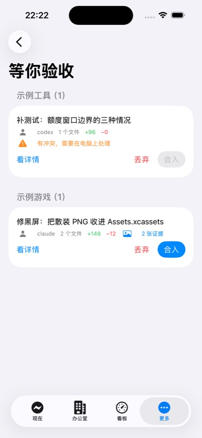

# LLMQuotaBar

多平台 LLM 订阅额度汇总工具。macOS 菜单栏常驻 + 命令行，跨多台电脑汇总，重点盯**额度到期作废**。

**零第三方依赖**：只用 Swift 标准库和系统框架（Foundation / AppKit / SwiftUI / Security 等），`Package.swift` 里没有任何外部 package，`swift build` 不联网拉依赖。

覆盖平台：Claude、Codex、Gemini、Qwen、Kimi、GLM、MiniMax、DeepSeek、火山方舟。

另有配套 iOS App：在手机上看各平台额度汇总，也能直接派活给电脑上的常驻工作循环。
它走的还是 iCloud 那条通道（见「多机汇总靠 iCloud」和 inbox/outbox），不需要额外服务器。

<p align="center">
  
</p>

<p align="center">
  <sub>不用装 Mac 端也能先看看 —— App 里点「先看看效果」进演示模式</sub>
</p>

<p align="center">
  
  
  
  
</p>

<p align="center">
  <sub>配套 iOS App：按「在漏什么」排序 · 每个平台一个工位 ·
  各窗口剩余 · agent 交的活带实跑截图</sub>
</p>

**实测空窗率**（一台真实在用的开发机，连续 30 天）：

| 平台 | 一次都没用过的窗口 |
|---|---|
| Codex | **82%** —— 154 个五小时窗里 127 个完全空着 |
| Kimi | 69% |
| GLM | 60% |
| Qwen | 53% |

「空窗」= 一整个额度窗口从头到尾没用过。那份订阅的钱直接打了水漂，
而且不会有任何提醒。

📖 **[项目主页](https://scott987-cmd.github.io/quotient/)**

---

## 五分钟跑起来

需要 macOS 和 Xcode 命令行工具（`xcode-select --install`），没有别的前置。

```bash
git clone <这个仓库> && cd LLMQuotaBar
swift build -c release
./.build/release/llmq collect     # 扫一遍本机装了哪些 CLI、用了多少
./.build/release/llmq report      # 看结果
```

**装了哪个平台就采哪个** —— 一个都没装也能跑，只是报表是空的。
不需要 API key，不需要登录，不联网：它读的是各 CLI 自己在本地留下的
会话日志和额度回报。

想先试试又不想弄脏自己的配置：

```bash
LLMQ_HOME=/tmp/llmq-试用 ./.build/release/llmq collect
```

整个数据目录会挪到那儿，删掉就干净了。

装成常驻（菜单栏 App + 定时采集）：

```bash
./build-app.sh --install
./.build/release/llmq install-agent    # 每 15 分钟自动采集
```

跨机汇总、手机 App、自动派活这些是**可选的**，各自独立，不装也不影响
上面这套。往下读对应章节。

## 三层，各自独立，用哪层装哪层

这个仓库其实是三样东西叠在一起。**下面一层不需要上面一层**，
只用第一层是零门槛的 —— 别被后面的篇幅吓到。

| 层 | 做什么 | 门槛 | 谁需要 |
|---|---|---|---|
| **1. 额度汇总** | 扫本机各 CLI 的用量，算出「哪份订阅要过期作废了」 | `swift build` 完就能用，不用配置 | 只想知道钱花在哪、哪份在浪费 |
| **2. 跨机汇总** | 多台电脑的用量合到一起看，手机 App 也读这份 | 要有 iCloud Drive，装个菜单栏 App 授权 | 有两台以上电脑 |
| **3. Agent 调度** | 按剩余额度自动挑平台派活、跑完自己提交、等你验收 | 要先装好并登录 claude/codex/qwen 这些 CLI | 想让闲置额度自动干活 |

第三层是这个项目最花力气的部分，但**它对大多数人不是必需的**。
先跑第一层，觉得有用再往上加。

---

## 支持哪些平台，各自需要什么

**它不需要任何 API key**，读的是各家 CLI 自己在本地留下的会话日志和额度回报。
装了哪个就采哪个，`llmq doctor` 会列出探测到了什么、路径在哪。

| 平台 | 需要装 | 数据来自 | 备注 |
|---|---|---|---|
| Claude | Claude Code | `~/.claude` 会话日志 | |
| Codex | Codex CLI | `~/.codex` 会话日志 | 日志里带官方回报的百分比，最准 |
| Gemini | Gemini CLI | `~/.gemini` | |
| Qwen | Qwen Code / iFlow | `~/.qwen`、`~/.iflow` | |
| Kimi | Kimi Code | `~/.kimi-code` | |
| GLM / DeepSeek / MiniMax / 火山方舟 | 用 Claude Code 接它们的端点 | `~/.glm`、`~/.minimax` 等 | 见下 |
| MiniMax（额度） | `mmx` CLI | `mmx quota show` | 官方直接回报剩余百分比和次数 |

**「Claude Code 兼容目录」是什么**：很多国产平台提供 Anthropic 兼容端点，
用法是把 `ANTHROPIC_BASE_URL` 指过去、`CLAUDE_CONFIG_DIR` 指到一个单独目录，
这样每个平台的会话日志各自分开。这个工具就按那些目录来区分平台。
你没这么用的话，那几行会显示「未检测到」，不影响其余功能。

**一个都没装也能跑** —— 报表是空的，但不会报错。

---

## 它解决什么问题

订阅了一堆平台，但看不到全局：哪个套餐快到期了还没用完（钱白花）、哪个装了根本没在用（该退订）、哪个快超额了（要转移工作量）。各家的用量页面还散在不同网站、不同电脑上。

这个工具从**各家 CLI 编码工具留在本地的日志**里把用量抠出来，归一化到同一套口径，跨机器合并后算出每条额度的剩余、重置倒计时和预计作废量。

## 核心设计

### 1. 按模型名归类，不按 CLI 归类

GLM / Kimi / MiniMax / DeepSeek / 火山的编码套餐，主流用法是把 Claude Code 或 Codex 的 `BASE_URL` 指到对方的兼容端点。那种情况下用量落在 `~/.claude` 或 `~/.codex` 里，只有模型名不同。

所以采集器**不按"哪个 CLI 产生的"归类，而按模型名归类**（`ModelRouter`）。`glm-4.6` 出现在 Claude Code 的日志里，也会正确记到 GLM 名下。这一条覆盖了大部分第三方平台，不需要给每家单独写采集器。

### 2. 去重是正确性的关键

- **Claude Code**：同一个 `requestId` 会写出多行（正文一行、每个 `tool_use` 各一行）。实测 300 个文件里就有 15515 组"多行 usage 完全一致"、1191 组"一行有值其余全零"。不去重会把用量放大一倍以上。做法：按 `requestId` 分组，逐字段取**最大值**（既合并重复，又不让全零行盖掉真值）。续接会话还会把旧消息抄进新文件，所以去重必须**跨文件全局**做。
- **Codex**：`total_token_usage` 是会话累计值，取**单调增量**。实测某会话按增量累加得 35733656，与最终累计值完全吻合；而累加 `last_token_usage` 会多算 12 万（同一轮会重复上报）。
- **Qwen Code**：`usage/token-usage-*.jsonl` 每条自带 uuid，直接用。

### 3. 只有 Codex 能拿到官方额度

Codex 会把 OpenAI 返回的配额状态写进会话日志（`rate_limits.primary`：`used_percent` / `window_minutes` / `resets_at` / `plan_type`）。这是所有平台里唯一不用猜、不用用户填的真实额度，工具直接采信，并盖过本地推算。

其他平台的套餐上限需要你自己填进 `plans.json`（见下文）。**工具不会替你猜数字** —— 各家档位和数值经常变，写死一个可能错的数字让你误信，比留空更糟。没填上限时照样统计用量和活跃度，只是不显示剩余百分比和作废量。

### 4. 周期窗口按本地自然日历对齐

"每日"额度按**本地时区**的自然日重置，不是按 Unix 纪元推（那样在北京时区会变成早上 8 点重置）。"每月"用日历月，不是固定 30 天。你也可以在 `plans.json` 里填 `anchor`（账单日），填了就按账单日推。

### 5. 多机汇总靠 iCloud，不需要服务器

每台电脑只写自己那一个快照文件（`<machineID>.json`），谁都不写别人的，所以不存在冲突合并。iCloud 只负责搬运。

## 安装

```bash
cd ~/Documents/LLMQuotaBar && ./build-app.sh
```

```bash
cp -R .build/release/LLMQuotaBar.app /Applications/ && cp .build/release/llmq ~/.local/bin/
```

启动菜单栏 App：

```bash
open /Applications/LLMQuotaBar.app
```

## iCloud 权限：为什么要装定时任务

iCloud Drive 受 macOS 隐私保护（TCC）。实测结论：

| 谁在跑 | 能否读写 iCloud |
|---|---|
| 终端里的 `llmq` | ✅ 继承终端的权限 |
| launchd 定时任务里的 `llmq` | ✅ |
| **双击启动的菜单栏 App** | ❌ `Operation not permitted` |

所以设计成：**`llmq` 负责跟 iCloud 打交道，App 只读本地。**

`llmq collect` 每次采集时会把 iCloud 里其他电脑的快照镜像一份到本地目录（本地不受 TCC 管），菜单栏 App 读本地就能看到全部机器。**只要装了定时任务（`llmq install-agent`），App 完全不需要任何额外授权。**

只有在「App 采集时 iCloud 被拒 **且** 确实只看得到一台电脑」时，面板才会显示橙色提示条，点「去授权」直达
**系统设置 → 隐私与安全性 → 完全磁盘访问权限**。装了定时任务的话你不会看到它。

另外，写入永远是本地优先：即使 iCloud 完全不可用，本机统计也照常工作，不会因为同步失败让整次采集报废。

## 使用

```bash
llmq doctor
```

先看本机认出了哪些数据源、哪些采集器已用真实数据验证过。

```bash
llmq plan edit
```

把各家订阅页面上的**实际额度上限**填进 `limit` 字段。这一步做完，剩余百分比、重置倒计时、作废预警才会生效。

```bash
llmq report
```

查看所有电脑汇总后的额度情况。

```bash
llmq install-agent 900
```

安装 launchd 定时采集（每 15 分钟）。菜单栏 App 自己也每 10 分钟采集一次，两者不冲突。

```bash
llmq waste
```

按平台统计额度窗口里没用掉的部分（空窗/浪费）。合并所有电脑的快照，配 plans 里的窗口长度算；某个平台没有用量数据时明说算不出来，不会报 100%。

其他命令：`llmq collect -v`（手动采集并看明细）、`llmq status`（一行摘要，脚本用）、`llmq report --json`。

调适配器时用这个精确对账：

```bash
llmq debug-parse kimi-code ~/.kimi-code/sessions/xxx/agents/agent-0/wire.jsonl
```

它只解析单个文件并打印分项统计。活跃会话的日志一直在被追加，直接拿汇总数字跟外部脚本对不齐 —— 把文件复制一份冻结，让两边解析同一份数据，差异才有意义。

```bash
llmq work loop
```

常驻循环：每隔一段时间查一次任务队列，有排队任务就按当前额度挑一个还有余量的平台跑，跑完把结果发到 iCloud 共享目录（手机 App 读它，也可以推 APNs 通知）。循环带单实例锁，重复启动的那个会直接退出 —— 两个调度器管同一批任务只会打架。另外有每小时任务数上限，队列被灌满时不至于一口气把额度烧光。

## 配置 plans.json

位置：`~/Library/Application Support/LLMQuotaBar/plans.json`

```jsonc
{
  "platform": "glm",
  "planName": "GLM Coding Plan",
  "monthlyCost": 20,        // 填了才能算出"闲置平台每月白花多少钱"
  "currency": "CNY",
  "limits": [
    {
      "id": "5h",
      "label": "5 小时",
      "windowMinutes": 300,
      "kind": "rolling",      // rolling=滚动窗口（不会作废）/ periodic=周期重置（会作废）
      "metric": "requests",   // requests / billableTokens / totalTokens / outputTokens / cost
      "limit": 120            // ← 从你的订阅页面抄过来
    }
  ]
}
```

`kind` 要选对：只有 `periodic`（到点清零）才会算"作废量"，`rolling` 是滚动窗口，用完等最早的调用滚出去就回血，没有作废一说。

## 各采集器的验证状态

用 `llmq doctor` 可以随时查看。当前状态：

| 采集器 | 数据源 | 能拿到 | 验证情况 |
|---|---|---|---|
| Claude Code | `~/.claude/projects/**/*.jsonl` | 模型、in/out/cache token、时间戳 | ✅ 4150 文件 1.09GB 真实数据，并与独立 Python 复算逐位对齐 |
| Codex | `~/.codex/sessions/**/*.jsonl` | token 增量 + **官方额度百分比** | ✅ 24 个 rollout 真实数据 |
| Qwen Code | `~/.qwen/usage/token-usage-*.jsonl` | 模型、token、uuid | ✅ 真实记录 |
| Kimi Code | `~/.kimi-code/sessions/**/wire.jsonl` | 模型、分项 token | ✅ 8 个文件 944 条记录，与独立 Python 复算逐位吻合（billable 4386665） |
| Gemini CLI | `~/.gemini/tmp/*/logs.json` | **只有请求次数，没有 token** | ✅ 格式已验证（该日志本身不记 token） |
| iFlow | `~/.iflow` | 同 Gemini 家族 | ⚠️ 按已知布局写，未用真实数据验证 |
| GLM / MiniMax / DeepSeek / 火山 | `~/.glm`、`~/.minimax` 等独立配置目录 | 同 Claude Code 格式 | ⚠️ 按已知布局写，未用真实数据验证 |

Kimi Code 有个坑值得记一笔：`usage.record` 里既有 `usageScope: "turn"`（单次调用）也有 `usageScope: "session"`（会话汇总）。实测 945 条里有 1 条是 session 汇总 —— 不过滤掉就会把那个会话算两遍。

### 还没接但值得接的：qianwen CLI

本机装了 `@qianwenai/qianwen-cli`，它有 `usage summary` / `usage free-tier` / `billing` / `subscription` 子命令，全部支持 `--format json`。这是**除 Codex 之外第二个能拿到官方额度的平台**，比填 plans.json 可靠得多。

但当前 `qianwen auth status` 返回 `token_expired`，登录态失效，没法验证 JSON schema。登录之后跑一下：

```bash
qianwen usage free-tier --format json
```

把输出给我，就能像 Codex 那样把官方额度直接接进来。

标 ⚠️ 的是按该工具已知的目录布局写的，本机没装、没能用真实数据验证。**但这不影响主路径** —— 这几家若是通过改 `BASE_URL` 用的，用量会落在 `~/.claude` / `~/.codex` 里，由模型名自动归类，不走这些采集器。独立配置目录（`CLAUDE_CONFIG_DIR` 分开放）才会用到。

装上对应 CLI 之后跑一次 `llmq collect -v` 核对数字；不对的话调整 `Sources/LLMQuotaCore/Adapters.swift` 里对应的适配器即可，接口是统一的。

## 在其他电脑上部署

1. 拷贝整个 `LLMQuotaBar` 目录过去（或用 git）
2. `./build-app.sh` 并安装
3. 授予完全磁盘访问权限
4. `llmq install-agent`

各台电脑的快照会自动汇总。`llmq report` 顶部会列出所有接入的电脑及其最后更新时间；超过 6 小时没更新的会标为"快照较旧"。

## 从手机派任务

不在电脑前也能加任务：往 iCloud Drive 的 `LLMQuotaBar/inbox/` 里丢一个纯文本文件，**文件内容就是任务描述**，不需要任何格式，文件名随便起。Mac 上的常驻循环下一轮扫队列时会把它捞起来执行，跑完把结果写回同级的 `outbox/`，文件名跟原任务对应。

iOS 上「文件」App 就能直接在这个目录里新建文本；想更省事用「快捷指令」——「听写文本 → 存储文件」两步存到该目录，放个主屏幕图标，一句话就派出去。

前提是 Mac 上的常驻循环在跑（`llmq work install-loop`）。没跑的时候文件就一直躺在 inbox 里等着，不会丢，也不会重复执行。

## 性能

首次采集要全量解析（本机 1.09GB / 4150 文件）约 **12 秒**。之后按文件的 `(size, mtime)` 跳过没变的文件，热缓存约 **1 秒**。缓存在 `~/Library/Application Support/LLMQuotaBar/cache/`，可随时删除重建。

同步到 iCloud 的快照约 260KB（5 分钟稀疏时间桶，保留 32 天）。

## 开发

```bash
swift test
```

28 个测试，覆盖模型路由、去重合并、Codex 增量、自然日历窗口对齐、作废/超额判定、各适配器解析。改采集逻辑前先跑一遍。

本项目支持局域网跨机派活
