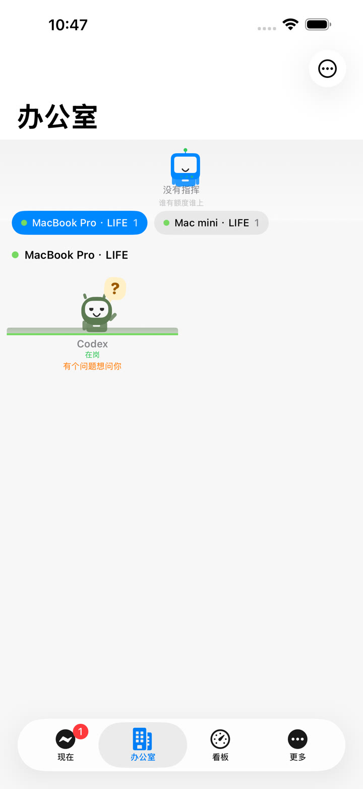
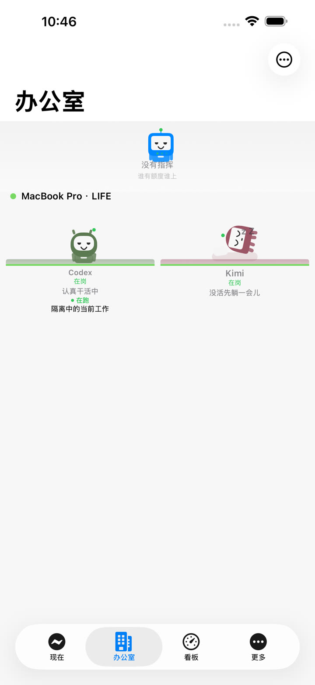
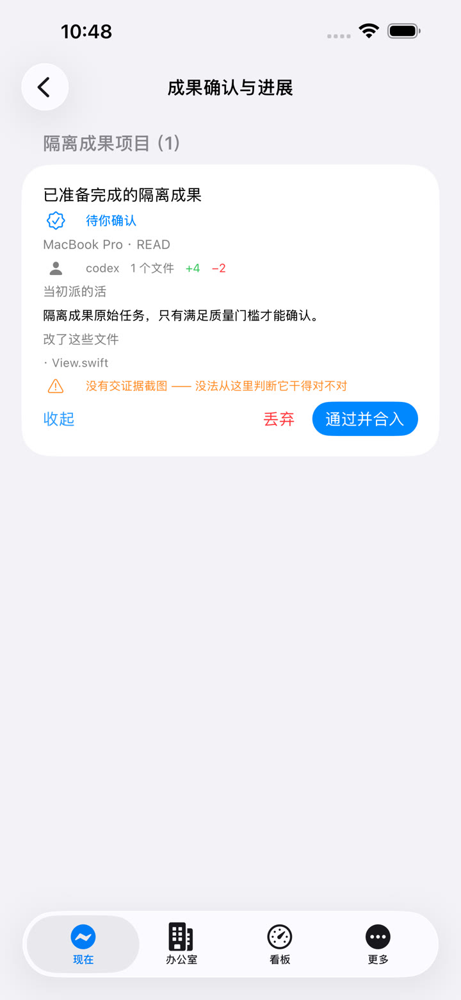

# Quotient

Quotient 把多台 Mac 上的 AI 编码工具额度、任务、问答和成果汇总到一个本地优先的工作系统，并用 iPhone/iPad 查看进展和处理可操作事项。

**现行公开源码分成两个仓库：**

- [Quotient Core](https://github.com/scott987-cmd/quotient-core)：macOS CLI、菜单栏 App 与多机任务协调。
- [Quotient Mobile](https://github.com/scott987-cmd/quotient-mobile)：iPhone/iPad 客户端。

本仓库保留[项目官网](https://scott987-cmd.github.io/quotient/)、真实演示素材和旧历史。旧提交仍可查看，但不是当前构建入口。

[查看多机协作架构图](https://scott987-cmd.github.io/quotient/#architecture)

## 已验证的能力

Core 能采集用量与额度、显示状态，并在用户自己的 Mac 之间协调明确登记的任务。Mobile 能按来源机器展示额度、工作、问答与成果；对缺字段的旧记录保持可读，危险操作要求完整来源和当前版本。官网展示真实 iPhone/iPad 截图和操作录屏。

2026-10-08 的干净 Core 快照在[公开 CI](https://github.com/scott987-cmd/quotient-core/actions) 完成 1,610 项测试，0 失败、2 项需交互钥匙串而跳过。Mobile 的独立 iPhone/iPad 回归、源码指纹和截图记录保存在开发工作区；[公开 Mobile CI](https://github.com/scott987-cmd/quotient-mobile/actions) 显示新仓库每次提交的构建与测试结果。模拟器通过不等于真实 APNs、跨机 iCloud 或物理手机验收。

<p align="center">
  
  
  
</p>

## 从源码运行

需要 macOS 14 或更新版本，以及 Swift 6 或更新版本。请从 **Core 新仓库**开始：

```sh
git clone https://github.com/scott987-cmd/quotient-core.git
cd quotient-core
swift build
swift test
swift run llmq --help
```

移动端使用 [Mobile 仓库的 XcodeGen 构建说明](https://github.com/scott987-cmd/quotient-mobile#build-for-the-simulator)。自己的真机、iCloud 和推送需要配置自己的 Apple Team、bundle ID 与签名。生成源码快照不包含私人钥匙、实际任务账本或 QA 录屏。

复杂项目交付，尤其完整游戏制作，仍是实验性能力。Agent 停止工作或提交代码不代表项目已可玩；每个项目都需独立验收可运行构建、玩法、画面和设备实录。[架构、演示、隐私政策及上架进度见官网](https://scott987-cmd.github.io/quotient/)。
