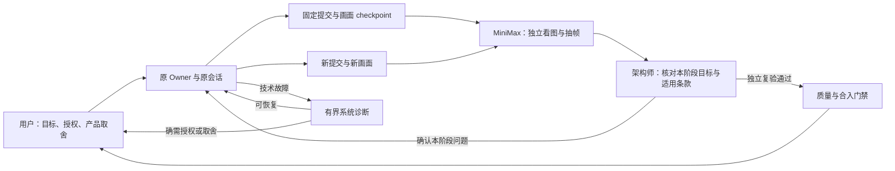

# 从任务执行到可验收交付：2026-09-06 架构修复

本轮依据真实代码、隔离复现和运行记录修复四条断点：技术中断反复转给用户、阶段观察没有进入整改闭环、手机把执行结束当作交付、控制面被大数据同步和计算拖住。

## 谁负责什么

“进程运行”“本次执行结束”“质量复验通过”“已经合入”分别是不同事实。收到问题的 ack 也不等于问题已经解决。手机只把当前确实能处理的事项计入待办，其他等待仍可查看来源和原因。

## A：技术中断由系统诊断

- 原任务最多一次自动恢复；诊断补充次数和期限有界，防止无限重启。
- 诊断报告绑定源任务、Owner、分支、提交和失败 attempt；固定文件之外的改动不能授权恢复。
- 恢复沿用原 Owner、稳定工作区与原生会话；真实授权、账号解锁和产品取舍仍交给用户。
- 仅撤回精确识别的旧版系统单选“继续”问题，不吞掉真实用户问答。
- 真实 Flint 任务已由诊断确认磁盘写满导致中断，并恢复原 Kimi 会话；新提交已经出现。该事实不等于游戏通过终验，也未授权合并或发布游戏。

## B：阶段问题有负责人、有关闭条件

- 固定提交中的 MiniMax 报告先进入架构师范围复核。架构师阅读报告、代码与适用目标，不冒充亲自看过画面。
- 只有确认适用的 `fixNow` 才形成定向 finding；延期、非目标或证据不足不会自动要求返工。
- 原 Owner 必须明确确认；自动续作次数持久记录且有上限，不能改 Owner、换分支或重建会话绕开。
- 关闭问题必须有新提交、新画面摘要、已完成的独立视觉报告和独立复核；旧画面、重复消息、同 runner 的另一台机器、Owner 自己签字都不能替代。
- 原 Owner 已推进提交时，迟到的旧观察不再发起新复核，迟到的架构师结论只记录范围过期。
- 全量回归曾发现旧协议转交的人类答复重新进入上下文；已恢复该兼容路径，同时保留新协议的 runner/机器身份校验。

## C：手机待办与交付状态一致

- 首页、角标与成果入口使用同一组可处理条件；没有额度快照时仍能看见任务和待办。
- 原生复核列表保留完整下发内容入口，兼容只提供分机页面的旧节点；分机合并、独立展开、动作与回执路由保持有效，旧共享页不能覆盖分机页面。
- 计划放行意图跨页面与重启保留，写入期间防重复，连接切换后不接受旧连接的迟到完成回调。
- 放行拒绝回执与已处理的原始意图一起同步；手机核对请求 UUID、目标机器和计划后显示失败并恢复重试。另一台机器或上一轮请求不能误解锁按钮；接受回执仍不能代替任务板的实际入队。
- 明确区分系统诊断、等待架构复核、等待质量复验、等待合入与已合入。
- 只有新鲜的运行中任务继续累计展示用时，历史任务不随墙上时钟变长。
- “近期执行结束”不是累计交付率；合入数量依据明确的 landedAt 或旧版等价状态。

## D：让控制面和阶段观察及时运行

- 阶段观察仅限系统 checkpoint 与完整原始提示词、每份画面的摘要和源提交全部匹配，并强制使用固定 `minimax.media` 执行器。
- 观察任务使用独立、只检出报告目录的工作区，原任务不必停工。普通开发继续遵守仓库独占，设备和工具冲突仍然拦截；不能把观察例外扩张为任意同仓库并行改代码。
- 同一源任务、提交与证据摘要共用核锁；未知活进程按冲突处理。正常结束后只回收无活进程、无未提交改动且任务版本仍匹配的观察工作区，报告分支保留。
- 禁止发布、禁止签名等明确禁用语句不再误占对应工具；旧任务只有恰好等于旧推断的资源集合才迁移，显式资源声明不被抹掉。
- 额度峰值计算保留原窗口语义，改为排序后滑动累计，避免反复扫描全部历史桶拖住控制循环。
- 发布通道优先同步证书、签名与当前载荷，最后发布 manifest；普通证据与历史安装包不再挡住更新。更新进程可独立刷新发布通道。
- 跨机版本核对支持完整目标 SHA；旧本地 manifest 下的“大家一致”不能冒充“全网已到新版本”。

## 验证与发布边界

冻结源版本：Core `ea0e47e`，App `2b04d8c`，计划 TestFlight 构建 `202609060801`。

- A 已经独立验收并安装到三台 Mac，发布包 `5aca97b655c2`。
- B 旧人类答复兼容补丁：72 项定向回归通过。
- D 最终定向：35 项通过；控制面 3 项、观察执行 5 项故障变异均被断言拦住，另有缺摘要、迟到报告、稀疏检出等先红后绿证据。
- 回执补丁前完整 Core 1,526 项中 1,524 项通过、2 项既有钥匙串交互测试跳过、0 失败。最新回执链路定向 46 项通过，手机 3 个新增边界变异均被拦住，恢复后 3 项回归通过。
- 最终 Core `ea0e47e` 完整 1,527 项：1,525 通过、2 项既有登录钥匙串交互测试跳过、0 失败、0 遗漏。arm64/x86_64 通用编译成功。
- 独立 C+D 验收通过：iPhone 完整 118 项（115 通过、3 跳过、0 失败），iPad 完整 118 项（116 通过、2 跳过、0 失败）；设备专属项互补覆盖，公共 producer 用最终 Core 重建后 1/1 补跑通过。实际 Core→Mirror→App 拒绝、恢复重试及旧回执隔离均实跑并检查截图。正式发布结果后续单列记录。
- 独立复查发现跨机时钟偏差导致有效计划拒绝被忽略：已用 Mac 慢两分钟的案例先红后绿修复，恢复后相关 3 项全部通过。
- 物理手机、真实 APNs、真实 iCloud 跨设备操作不能由模拟器结果替代；本轮不据此宣称可以直接提交 App Review。

运行日志、失败复现、源文件指纹及设备截图保存在 LLMQuotaApp 的 `qa-reports/2026-09-06-*`。未验证项和旧失败日志保留，不通过删除断言、日志或证据换取“全绿”。
